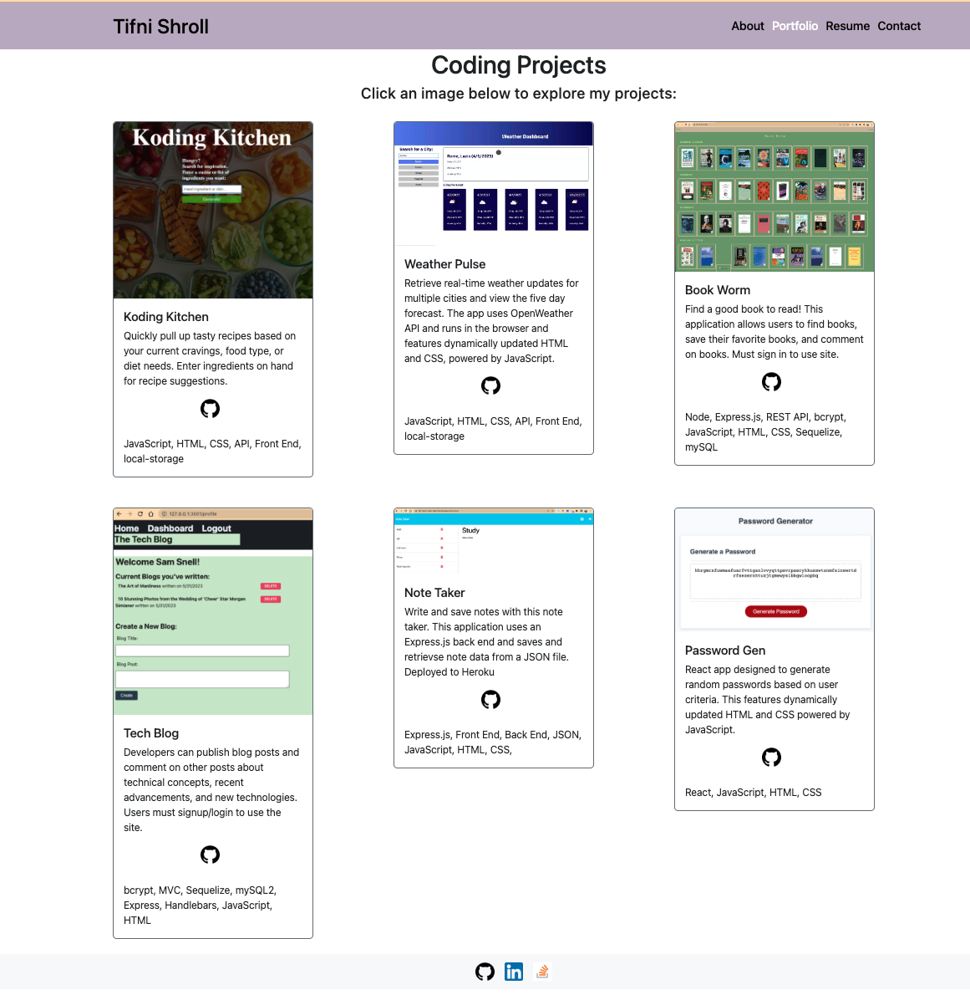

# career portfolio
My portfolio showcases my talents and skills with Web development. It contains my strongest work as well as the thought processes behind them. Each project contains a link to my code and to the deployed project.

## Deployed Webpage

https://tasshroll.github.io/TS-Career-Portfolio/

## Git Hub Repository

https://github.com/tasshroll/TS-Career-Portfolio

## Description
This porfolio was built with React. It contains links to current completed projects, both individual and group, as well as my contact information. 

Coding projects include:

* Recipe Finder 
* Weather App
* Book Worm
* Tech Blog
* Note Taker
* Password Generator React

Portfolio Screenshot

## Usage
Click, scroll, and re-size window to interact with the elements. Links within the page showcase my current work as well as contact info.

## License

